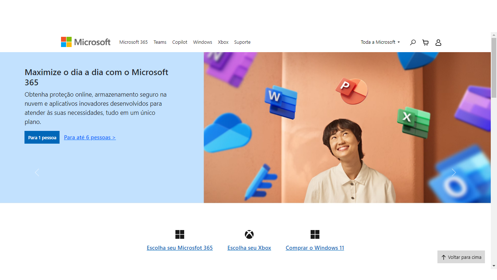

# microsoft-website-reconstruction

> Este pequeno projeto é para fins educativos e aprendizado. Apenas refiz/restruturei a página atual da Microsoft.

## 📫 Contribuindo para microsoft-website-reconstruction

Para contribuir com microsoft-website-reconstruction, siga estas etapas:

1. Bifurque este repositório.
2. Crie um branch: `git checkout -b <nome_branch>`.
3. Faça suas alterações e confirme-as: `git commit -m '<mensagem_commit>'`
4. Envie para o branch original: `git push origin <nome_do_projeto> / <local>`
5. Crie a solicitação de pull.

Como alternativa, consulte a documentação do GitHub em [como criar uma solicitação pull](https://help.github.com/en/github/collaborating-with-issues-and-pull-requests/creating-a-pull-request).

